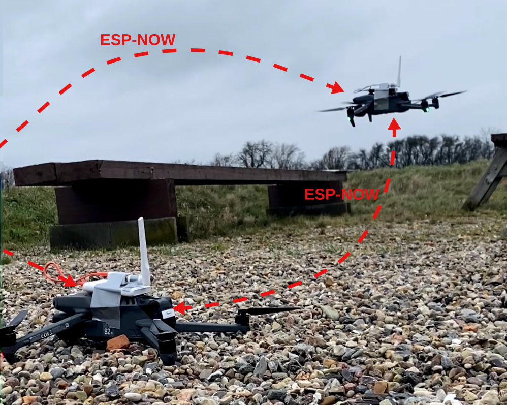
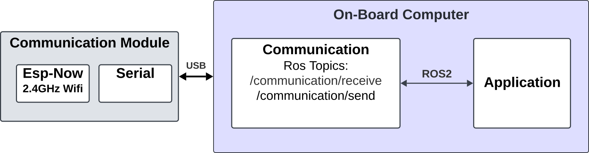

# SwarmTalk


SwarmTalk is an open-source, low-cost solution for decentralized UAV-to-UAV communication that breaks down barriers to scalable multi-UAV systems. Leveraging the 2.4GHz Wi-Fi spectrum and ESP-NOW protocol, this project enables UAVs to seamlessly exchange binary data through an ad-hoc network with effortless ROS 2 integration. UAVs can dynamically join or leave operations without centralized control or extensive pre-configuration.

## Table of Contents
- [Features](#features)
- [System Architecture](#system-architecture)
- [Installation](#installation)
- [Quick Start](#quick-start)
- [Project Structure](#project-structure)
- [Usage Examples](#usage-examples)
- [Configuration](#configuration)
- [Docker Support](#docker-support)
- [Hardware Requirements](#hardware-requirements)
- [Contributing](#contributing)
- [Citation](#citation)
- [License](#license)

## Features

- **🔄 Decentralized Communication:** No need for existing infrastructure or centralized control
- **📡 Ad-hoc Networking:** UAVs can join or leave the network dynamically  
- **🤖 Seamless ROS 2 Integration:** Native compatibility with ROS 2 Humble for flexible UAV operations
- **💰 Low-cost Implementation:** Utilizes widely available ESP32 modules
- **⚡ High-speed Data Exchange:** Binary data transmission up to 1490 bytes per message
- **🔧 Plug-and-play:** Minimal configuration required for deployment
- **🐳 Docker Support:** Containerized deployment for easy scaling

## System Architecture



The system consists of three main components:

### Core Components
- **Communication Driver Node** (Blue): ROS 2 node handling serial communication with ESP32
- **Planning Node** (Blue): Path planning and coordination algorithms  
- **ESP32 Firmware** (Gray): Hardware communication layer using ESP-NOW protocol

### Data Flow
1. **ROS 2 Topics:** `/communication/broadcast` (outgoing) and `/communication/message` (incoming)
2. **Serial Communication:** UART interface between onboard computer and ESP32
3. **Wireless Communication:** ESP-NOW protocol for UAV-to-UAV data exchange

## Installation

### Prerequisites
- **ROS 2 Humble** - [Installation Guide](https://docs.ros.org/en/humble/Installation.html)
- **ESP-IDF** (for firmware development) - [Installation Guide](https://docs.espressif.com/projects/esp-idf/en/latest/esp32/get-started/)
- **Docker & Docker Compose** (optional) - [Installation Guide](https://docs.docker.com/get-docker/)

### Building from Source

1. **Clone the repository:**
   ```bash
   git clone https://github.com/kasperg3/swarmtalk.git
   cd swarmtalk
   ```

2. **Install dependencies:**
   ```bash
   sudo apt-get update
   sudo apt-get install python3-pip python3-setuptools
   pip3 install pyserial trajallocpy==0.0.14 shapely extremitypathfinder[numba] matplotlib numpy geojson
   ```

3. **Build ROS 2 packages:**
   ```bash
   source /opt/ros/humble/setup.bash
   colcon build --symlink-install --packages-skip swarmtalk_firmware
   source install/setup.bash
   ```

## Quick Start

### 1. Flash ESP32 Firmware
```bash
cd firmware
idf.py -p /dev/ttyUSB0 build flash monitor
```

### 2. Configure Agent Parameters
Edit configuration files in `config/` directory:
```yaml
# config/config_agent0.yaml
driver:
  ros__parameters:
    port: '/dev/ttyACM0'
planner:
  ros__parameters:
    n_agents: 3
    agent_id: 0
    capacity: 3000
```

### 3. Launch Communication Driver
```bash
source install/setup.bash
ros2 run communication driver --ros-args --params-file config/config_agent0.yaml
```

### 4. Launch Planning Node
```bash
source install/setup.bash  
ros2 run planning planner --ros-args --params-file config/config_agent0.yaml
```

> **Note:** You can test the message format logic without ROS 2 by running the standalone examples in the Usage Examples section below.

## Project Structure

```
swarmtalk/
├── common_interface/          # ROS 2 message definitions
│   ├── msg/
│   │   └── ByteArray.msg     # Custom message type (max 1490 bytes)
│   └── package.xml
├── communication/             # Communication driver package
│   ├── communication/
│   │   └── driver.py         # Serial communication handler
│   ├── Dockerfile
│   └── package.xml
├── planning/                  # Path planning package  
│   ├── planning/
│   │   └── planner.py        # CBBA-based coordination
│   ├── launch/               # Launch files
│   ├── Dockerfile
│   └── package.xml
├── firmware/                  # ESP32 firmware
│   ├── main/                 # ESP-NOW implementation
│   ├── CMakeLists.txt
│   └── sdkconfig
├── config/                    # Agent configuration files
│   ├── config_agent0.yaml
│   ├── config_agent1.yaml
│   └── config_agent2.yaml
├── experiments/               # Experimental setups
├── _site/                     # Web interface and diagrams
└── docker-compose.yml         # Multi-agent deployment
```

## Usage Examples

### Testing Message Format (Standalone)

Before working with ROS 2, you can test the message format logic:

```python
#!/usr/bin/env python3
"""
Test SwarmTalk message format without ROS 2 dependencies
"""
import struct

# Mock ByteArray class (matches ROS 2 ByteArray)
class ByteArray:
    def __init__(self, bytes):
        self.bytes = bytes

def test_message_format():
    # Test data conversion
    test_data = b"Hello from UAV!"
    
    # Convert to ByteArray format (as used in SwarmTalk)
    msg = ByteArray(bytes=[bytes([b]) for b in test_data])
    
    # Convert back to bytes
    recovered = bytes(b''.join(msg.bytes))
    
    assert test_data == recovered
    print(f"✅ Sent: {test_data}")
    print(f"✅ Received: {recovered}")

if __name__ == '__main__':
    test_message_format()
```

**Test the example:**
```bash
python3 test_message_format.py
# Output: ✅ Sent: b'Hello from UAV!'
#         ✅ Received: b'Hello from UAV!'
```
```

### Basic Message Broadcasting

```python
import rclpy
from rclpy.node import Node
from common_interface.msg import ByteArray

class ExamplePublisher(Node):
    def __init__(self):
        super().__init__('example_publisher')
        self.publisher = self.create_publisher(ByteArray, '/communication/broadcast', 10)
        
    def send_message(self, data: bytes):
        msg = ByteArray()
        msg.bytes = [bytes([b]) for b in data]
        self.publisher.publish(msg)
        self.get_logger().info(f'Sent {len(data)} bytes')

# Usage
rclpy.init()
node = ExamplePublisher()
node.send_message(b"Hello from UAV!")
```

### Receiving Messages

```python
from common_interface.msg import ByteArray

class ExampleSubscriber(Node):
    def __init__(self):
        super().__init__('example_subscriber')
        self.subscription = self.create_subscription(
            ByteArray, '/communication/message', self.message_callback, 10)
            
    def message_callback(self, msg):
        data = b''.join(msg.bytes)
        self.get_logger().info(f'Received: {data.decode()}')
```

### Multi-Agent Coordination

```python
# Example from planning/planner.py
from trajallocpy import Agent, CoverageProblem, CBBA

class SwarmPlanner(Node):
    def __init__(self, agent_id, n_agents):
        super().__init__(f'planner_{agent_id}')
        self.agent_id = agent_id
        self.n_agents = n_agents
        
        # Initialize CBBA algorithm
        self.agent = Agent(agent_id)
        self.cbba = CBBA()
        
    def coordinate_with_swarm(self):
        # Broadcast winning bids to other agents
        message = self.serialize_bids()
        self.broadcast_message(message)
```

## Configuration

### Serial Port Configuration
```yaml
driver:
  ros__parameters:
    port: '/dev/ttyACM0'  # USB serial port for ESP32
```

### Multi-Agent Setup
```yaml
planner:
  ros__parameters:
    n_agents: 3      # Total number of UAVs in swarm
    agent_id: 0      # Unique identifier (0, 1, 2...)
    capacity: 3000   # Agent capacity for task allocation
```

### ESP32 Firmware Configuration
```c
// firmware/main/main.c
#define ESP_NOW_CHANNEL 1
#define MAX_MESSAGE_SIZE 1490
#define BROADCAST_ADDR {0xFF, 0xFF, 0xFF, 0xFF, 0xFF, 0xFF}
```

## Docker Support

### Launch Multiple Agents
```bash
# Start 3-agent system
docker-compose up --build

# Scale to more agents
docker-compose up --scale communication0=1 --scale planning0=1 \
                  --scale communication1=1 --scale planning1=1 \
                  --scale communication2=1 --scale planning2=1
```

### Individual Container Build
```bash
# Build communication module
docker build -f communication/Dockerfile -t swarmtalk_comm .

# Build planning module  
docker build -f planning/Dockerfile -t swarmtalk_plan .
```

## Hardware Requirements

### Minimum Requirements
- **Onboard Computer:** Raspberry Pi 4 or equivalent (ARM64/x86_64)
- **Communication Module:** ESP32-C3, ESP32-C6, or ESP32-S3
- **Connection:** USB or UART interface
- **Memory:** 2GB RAM minimum

### Recommended Setup
- **UAV Platform:** DJI Matrice, Pixhawk-based systems
- **Companion Computer:** NVIDIA Jetson Nano/Xavier  
- **ESP32 Module:** ESP32-S3 with external antenna
- **Range:** ~200m line-of-sight communication

### Supported ESP32 Variants
| Model | Support | Flash Tool |
|-------|---------|------------|
| ESP32-C3 | ✅ | `_site/manifest-esp32c3.json` |
| ESP32-C6 | ✅ | `_site/manifest-esp32c6.json` |  
| ESP32-S3 | ✅ | `_site/manifest-esp32s3.json` |

## Contributing

1. Fork the repository
2. Create your feature branch (`git checkout -b feature/amazing-feature`)
3. Commit your changes (`git commit -m 'Add amazing feature'`)
4. Push to the branch (`git push origin feature/amazing-feature`)
5. Open a Pull Request

### Development Guidelines
- Follow ROS 2 coding standards
- Add unit tests for new features
- Update documentation for API changes
- Test with both simulated and hardware setups

## Citation

If you use SwarmTalk in your research, please cite:

```bibtex
@inproceedings{grontved2025Communication,
  title={Communication for UAV Swarms: an Open-source, Low-cost Solution Based on ESP-NOW},
  author={Gr{\u{o}}ntved, Kasper AR and Ladig, Robert and Lyhne Christensen, Anders},
  booktitle={2024 International Conference on Unmanned Aircraft Systems (ICUAS)},
  year={2025},
  note={Accepted},
  organization={IEEE}
}
```

## License

This project is licensed under the MIT License. See the [LICENSE](./LICENSE) file for details.

---

🚁 **Ready to deploy?** Check out our [web-based firmware installer](_site/index.html) for easy ESP32 setup!

**Questions?** Open an issue on [GitHub Issues](https://github.com/kasperg3/swarmtalk/issues) or join our community discussions.
